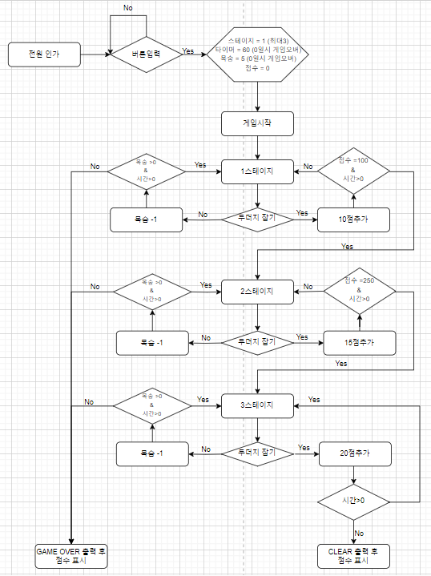
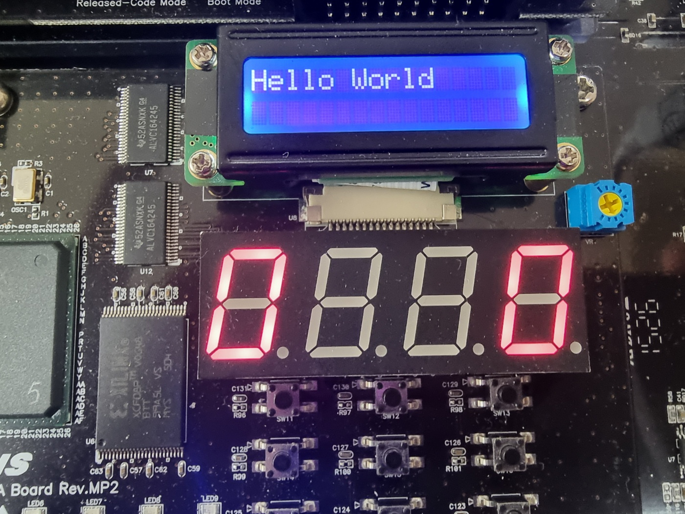
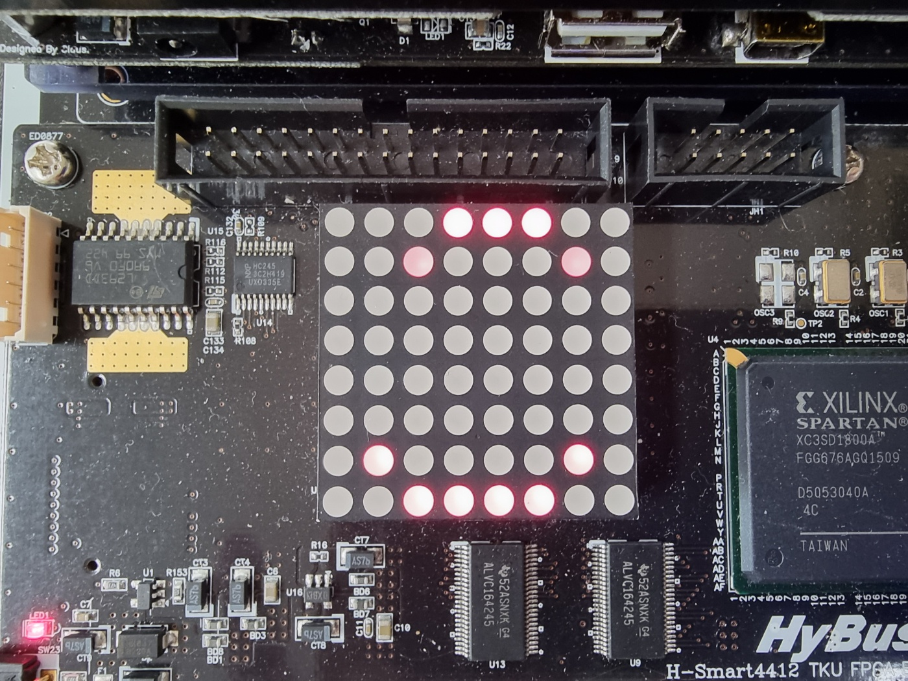
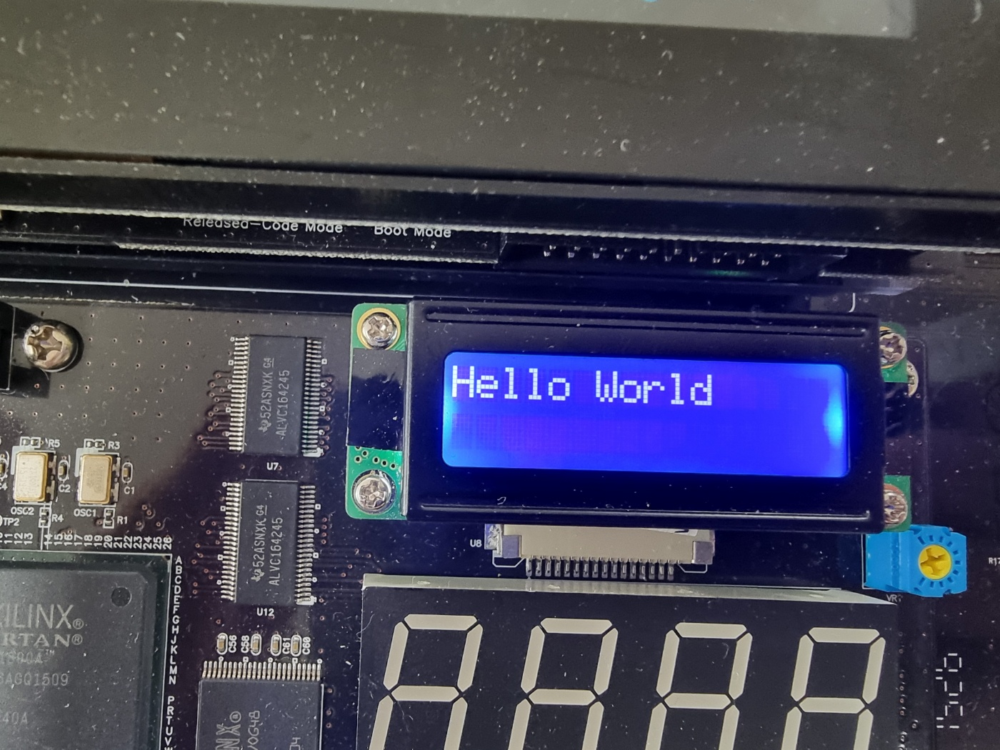
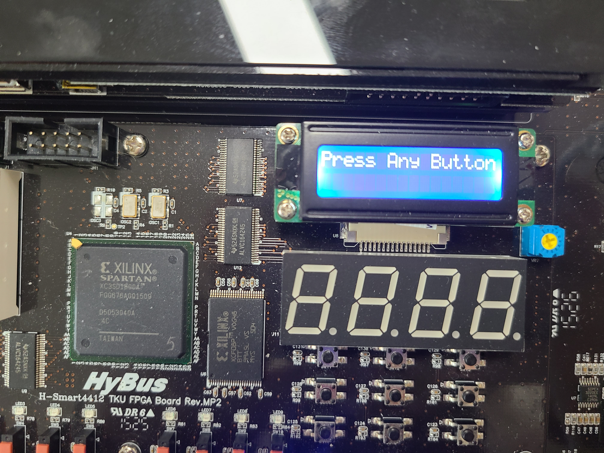
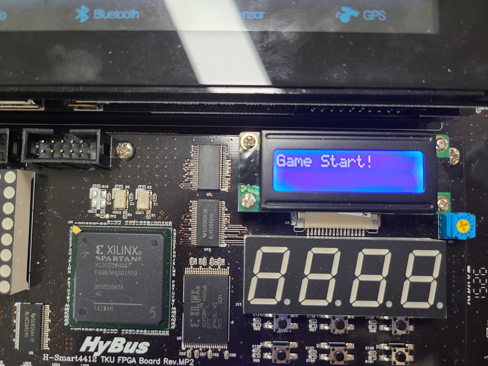

# 2주차 정리
## 1. 두더지 잡기 게임 순서도

## 2. 입출력 장치 작동 여부 확인
우분투에서 테스트 코드를 컴파일하여 저장하고 그 파일을 윈도우에 복사해준다. 
그 후 terra term을 통해 파일을 전송하고 권한을 부여해준후 실행하여 결과를 확인해보자.

###  test_Fnd

###  test_Dot_Matrix

###  test_LCD

## 3. 버튼을 눌러 게임 시작
택트 스위치중 아무 버튼이나 누르면 game start를 LCD에 출력하며 게임이 시작된다.

게임이 시작되면 두더지가 생성된다.
## Dot Matrix에 두더지 생성

## 출처
두더지잡기게임 : https://m.blog.naver.com/PostView.naver?isHttpsRedirect=true&blogId=bieemiho92&logNo=220744722833, https://github.com/2022HKNUiotprogrammingTeam1
